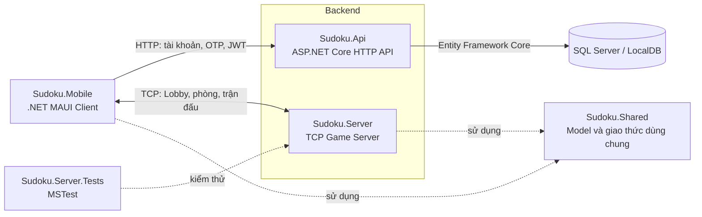

# UDM_17 — Game Sudoku đối kháng

## 1. Thông tin đề tài

| Thông tin | Nội dung |
|---|---|
| Mã đề tài | `UDM_17` |
| Tên đề tài | `Game Sudoku đối kháng` |

UDM_17 là hệ thống chơi Sudoku đối kháng giữa hai người chơi. Người dùng có thể đăng ký, xác thực tài khoản, đăng nhập, vào Lobby, tạo hoặc tham gia phòng, tìm đối thủ nhanh và gửi lời thách đấu trực tiếp.

Game Server tạo đề Sudoku, quản lý trạng thái trận đấu, xác thực nước đi, đồng bộ tiến độ, xử lý thời gian, kết nối lại, spectator và kết quả thắng/thua. Ứng dụng cũng hiển thị lịch sử trận được lưu trong thời gian Game Server đang hoạt động.

## 2. Danh sách thành viên nhóm UDM_17 Game Sudoku đối kháng

| STT | Họ và tên | Vai trò |
|---:|---|---|
| 1 | Lê Tấn Phúc | Nhóm trưởng - BE |
| 2 | Ngô Ngọc Phương Nghi | BE - Tester |
| 3 | Huỳnh Nhật Phương | BE |
| 4 | Nguyễn Minh Tuấn | FE |
| 5 | Trương Tuấn Việt | FE |
| 6 | Phạm Phú Anh Duy | FE |

## 3. Kiến trúc hệ thống

Hệ thống sử dụng mô hình Client–Server. Authentication API cung cấp chức năng tài khoản qua HTTP; Game Server quản lý Lobby, phòng và trận đấu qua TCP; ứng dụng .NET MAUI giao tiếp với cả hai dịch vụ.



| Thành phần | Trách nhiệm |
|---|---|
| `Sudoku.Mobile` | Client .NET MAUI: đăng nhập, đăng ký, quên mật khẩu, Lobby, phòng, trận đấu, spectator, lịch sử và kết quả. |
| `Sudoku.Api` | ASP.NET Core API: đăng ký, OTP, đăng nhập, JWT, phiên đăng nhập và đặt lại mật khẩu. |
| `Sudoku.Server` | Windows Forms TCP server: kết nối, phiên chơi, phòng, challenge, trận đấu, thời gian, nước đi, spectator và lịch sử. |
| `Sudoku.Server/Network` | Giao thức TCP, đóng gói message, handshake, heartbeat, reconnect và điều phối request. |
| `Sudoku.Server/Game` | Tạo phòng, challenge, sinh Sudoku, xác thực nước đi và quản lý vòng đời trận đấu. |
| `Sudoku.Shared` | Model, contract và kiểu message dùng chung giữa client và Game Server. |
| `Sudoku.Server.Tests` | Automated test MSTest cho game logic, giao thức, thời gian và xử lý lỗi. |
| `testing` | Script kiểm thử API, TCP, load, stress, soak và kết quả performance. |

Địa chỉ mặc định:

| Dịch vụ | Địa chỉ |
|---|---|
| Authentication API | `http://127.0.0.1:5243` |
| TCP Game Server | `0.0.0.0:5000` |

TCP Client có handshake, session token, heartbeat, request/response theo correlation ID, nhận sự kiện server và tự động thử kết nối lại.

## 4. Cấu trúc thư mục

```text
UDM17-Sudoku/
├── Sudoku.Api/
│   ├── Controllers/
│   ├── Data/
│   ├── DTO/
│   ├── Migrations/
│   ├── Models/
│   └── Services/
├── Sudoku.Mobile/
│   ├── Models/
│   ├── Network/
│   ├── Platforms/
│   ├── Resources/
│   ├── Services/
│   ├── ViewModels/
│   └── Views/
├── Sudoku.Server/
│   ├── Game/
│   ├── Network/
│   ├── Form1.cs
│   └── Program.cs
├── Sudoku.Shared/
│   ├── Models/
│   ├── Network/
│   └── Utils/
├── Sudoku.Server.Tests/
├── testing/
│   └── performance/
├── testcase.md
├── UDM17-Sudoku.slnx
└── README.md
```

- `Sudoku.Api`: API xác thực và dữ liệu tài khoản.
- `Sudoku.Mobile`: giao diện và logic client.
- `Sudoku.Server`: TCP server và nghiệp vụ game.
- `Sudoku.Shared`: model và giao thức dùng chung.
- `Sudoku.Server.Tests`: automated test.
- `testing`: script và dữ liệu kiểm thử tích hợp/performance.

Các thư mục sinh tự động như `bin`, `obj`, `.vs` và `TestResults` không thuộc source code chính.

## 5. Yêu cầu môi trường

- Windows 10 hoặc Windows 11 để chạy đầy đủ hệ thống.
- .NET SDK 10.
- Visual Studio hỗ trợ solution `.slnx`.
- Workload `.NET Multi-platform App UI development`.
- Workload `.NET desktop development`.
- .NET Framework 4.7.2 Developer Pack.
- SQL Server LocalDB hoặc SQL Server tương thích.
- Git.

Windows client yêu cầu tối thiểu Windows `10.0.17763.0`; target framework là `net10.0-windows10.0.19041.0`.

| Project | Framework |
|---|---|
| `Sudoku.Api` | `net10.0` |
| `Sudoku.Mobile` | `net10.0-android`, `net10.0-ios`, `net10.0-maccatalyst`, `net10.0-windows10.0.19041.0` |
| `Sudoku.Server` | .NET Framework 4.7.2 |
| `Sudoku.Shared` | .NET Framework 4.7.2 |
| `Sudoku.Server.Tests` | `net472` |

Package chính của API: ASP.NET Core OpenAPI `10.0.11`, Entity Framework Core SQL Server/Tools `9.0.0`, JWT Bearer `9.0.0` và BCrypt.Net-Next `4.0.3`. Test project sử dụng Microsoft.NET.Test.Sdk `17.12.0` và MSTest `3.6.4`.

Kiểm tra môi trường:

```powershell
dotnet --info
dotnet workload list
```

Nếu thiếu MAUI:

```powershell
dotnet workload install maui
```

## 6. Cấu hình hệ thống

### Authentication API

Các file cấu hình:

```text
Sudoku.Api/appsettings.json
Sudoku.Api/appsettings.Development.json
Sudoku.Api/Properties/launchSettings.json
```

| Cấu hình | Ý nghĩa |
|---|---|
| `ConnectionStrings:DefaultConnection` | Kết nối SQL Server cho tài khoản, OTP và phiên đăng nhập. |
| `EmailSettings:SmtpServer/SmtpPort` | SMTP server và port gửi OTP. |
| `EmailSettings:SenderName/SenderEmail/SenderPassword` | Danh tính và thông tin xác thực người gửi. |
| `JwtSettings:SecretKey/Issuer/Audience` | Cấu hình tạo và xác thực JWT. |

Không commit password, token hoặc secret. Nên dùng User Secrets hoặc biến môi trường:

```powershell
$env:ConnectionStrings__DefaultConnection = "<chuỗi-kết-nối-SQL-Server>"
$env:EmailSettings__SenderEmail = "<email-gửi-OTP>"
$env:EmailSettings__SenderPassword = "<mật-khẩu-ứng-dụng>"
$env:JwtSettings__SecretKey = "<khóa-bí-mật-đủ-dài>"
```

API tự áp dụng Entity Framework migration khi khởi động. Profile HTTP mặc định là `http://localhost:5243`.

### Mobile Client

| Biến | Windows | Android Emulator | Ý nghĩa |
|---|---|---|---|
| `SUDOKU_API_URL` | `http://127.0.0.1:5243/` | `http://10.0.2.2:5243/` | URL Authentication API. |
| `SUDOKU_GAME_HOST` | `127.0.0.1` | `10.0.2.2` | Host TCP Game Server. |
| `SUDOKU_GAME_PORT` | `5000` | `5000` | Port TCP Game Server. |

Ví dụ backend tại `192.168.1.10`:

```powershell
$env:SUDOKU_API_URL = "http://192.168.1.10:5243/"
$env:SUDOKU_GAME_HOST = "192.168.1.10"
$env:SUDOKU_GAME_PORT = "5000"
```

Firewall phải cho phép các cổng sử dụng. Game Server hiện đặt cố định port `5000` trong `Sudoku.Server/Form1.cs`. Phòng và lịch sử trận được lưu in-memory, không tồn tại sau khi Game Server tắt.

## 7. Hướng dẫn cài đặt

```powershell
git clone https://github.com/letanphucthichdichoi11-sudo/UDM17-Sudoku.git
cd UDM17-Sudoku
dotnet restore .\UDM17-Sudoku.slnx
```

Nếu project .NET Framework không restore bằng `dotnet`, mở **Developer PowerShell for Visual Studio**:

```powershell
msbuild .\UDM17-Sudoku.slnx /restore
```

Cấu hình database, SMTP và JWT bằng biến môi trường hoặc cấu hình development cục bộ trước khi chạy.

Build API:

```powershell
dotnet build .\Sudoku.Api\Sudoku.Api.csproj
```

Build Game Server trong Developer PowerShell:

```powershell
msbuild .\Sudoku.Server\Sudoku.Server.csproj /p:Configuration=Debug
```

Build Windows client:

```powershell
dotnet build .\Sudoku.Mobile\Sudoku.Mobile.csproj `
    -f net10.0-windows10.0.19041.0
```

## 8. Hướng dẫn chạy

Chạy các lệnh từ thư mục chứa `UDM17-Sudoku.slnx`.

### Bước 1 — Khởi động Authentication API

```powershell
$env:ASPNETCORE_ENVIRONMENT = "Development"
dotnet run --project .\Sudoku.Api\Sudoku.Api.csproj --launch-profile http
```

Kết quả mong đợi: `Now listening on: http://localhost:5243`.

Development tự tạo hai tài khoản nếu chưa tồn tại:

| Username | Password |
|---|---|
| `test_player_a` | `SudokuTest!2026` |
| `test_player_b` | `SudokuTest!2026` |

### Bước 2 — Khởi động TCP Game Server

`Sudoku.Server` là Windows Forms .NET Framework 4.7.2 nên không chạy bằng `dotnet run`. Trong Developer PowerShell:

```powershell
msbuild .\Sudoku.Server\Sudoku.Server.csproj /p:Configuration=Debug
& ".\Sudoku.Server\bin\Debug\Sudoku.Server.exe"
```

Hoặc mở `UDM17-Sudoku.slnx` bằng Visual Studio, chọn `Sudoku.Server` làm Startup Project và nhấn `Ctrl + F5`.

### Bước 3 — Khởi động Client 1

```powershell
dotnet build .\Sudoku.Mobile\Sudoku.Mobile.csproj `
    -f net10.0-windows10.0.19041.0

& ".\Sudoku.Mobile\bin\Debug\net10.0-windows10.0.19041.0\win-x64\Sudoku.Mobile.exe"
```

Đăng nhập bằng tài khoản thứ nhất.

### Bước 4 — Khởi động Client 2

```powershell
& ".\Sudoku.Mobile\bin\Debug\net10.0-windows10.0.19041.0\win-x64\Sudoku.Mobile.exe"
```

Đăng nhập bằng tài khoản khác.

### Bước 5 — Kiểm tra kết nối

```powershell
Get-NetTCPConnection -State Listen |
    Where-Object { $_.LocalPort -in 5000, 5243 } |
    Select-Object LocalAddress, LocalPort, OwningProcess
```

Kết nối thành công khi API lắng nghe port `5243`, Game Server lắng nghe port `5000`, client đăng nhập và chuyển đến Lobby. Hai client sau đó có thể tạo/tham gia phòng, Quick Match hoặc challenge; khi cả hai sẵn sàng, trận đấu bắt đầu.

### Bước 6 — Chạy automated testing

```powershell
dotnet restore .\Sudoku.Server.Tests\Sudoku.Server.Tests.csproj
dotnet test .\Sudoku.Server.Tests\Sudoku.Server.Tests.csproj `
    --verbosity:normal
```

Chạy không build lại:

```powershell
dotnet test .\Sudoku.Server.Tests\Sudoku.Server.Tests.csproj `
    --no-build --verbosity:normal
```

Chạy một nhóm hoặc một test class:

```powershell
dotnet test .\Sudoku.Server.Tests\Sudoku.Server.Tests.csproj `
    --filter "SudokuGeneratorTests|MatchCoordinatorTests|NetworkProtocolTests"

dotnet test .\Sudoku.Server.Tests\Sudoku.Server.Tests.csproj `
    --filter "FullyQualifiedName~SudokuGeneratorTests"
```

Xuất kết quả TRX:

```powershell
dotnet test .\Sudoku.Server.Tests\Sudoku.Server.Tests.csproj `
    --logger "trx;LogFileName=automated-tests.trx" `
    --results-directory .\TestResults
```

Test đạt khi kết quả có `failed: 0`. File báo cáo nằm tại `TestResults/automated-tests.trx`.

### Bước 7 — Chạy integration và performance test

API port `5243` phải chạy trước khi kiểm thử API; Game Server port `5000` phải chạy trước khi kiểm thử TCP.

```powershell
.\testing\api_execution.ps1
.\testing\tcp_execution.ps1
.\testing\load_execution.ps1
.\testing\soak_execution_strict.ps1
```

Dữ liệu performance nằm tại `testing/performance/`; log cục bộ có thể nằm tại `.runlogs/`.

### Chạy hai client tự động trong Debug

```powershell
$mobileExe = Resolve-Path `
    ".\Sudoku.Mobile\bin\Debug\net10.0-windows10.0.19041.0\win-x64\Sudoku.Mobile.exe"

Start-Process -FilePath $mobileExe -ArgumentList "--dev-player=test_player_a"
Start-Process -FilePath $mobileExe -ArgumentList "--dev-player=test_player_b"
```

Tự động đăng nhập và Quick Match:

```powershell
Start-Process -FilePath $mobileExe `
    -ArgumentList "--dev-player=test_player_a", "--dev-quick-match"
Start-Process -FilePath $mobileExe `
    -ArgumentList "--dev-player=test_player_b", "--dev-quick-match"
```

Tham số `--dev-*` chỉ hoạt động trong Debug build.

### Chạy Android Emulator

```powershell
dotnet build .\Sudoku.Mobile\Sudoku.Mobile.csproj -f net10.0-android
dotnet build .\Sudoku.Mobile\Sudoku.Mobile.csproj -f net10.0-android -t:Run
```

Android Emulator dùng `10.0.2.2` để truy cập backend trên host.

## 9. Luồng hoạt động cơ bản

```text
Khởi động Authentication API và TCP Game Server
                        ↓
       Đăng ký + OTP hoặc đăng nhập
                        ↓
          TCP Handshake và vào Lobby
                        ↓
   Tạo/tham gia phòng, Quick Match hoặc challenge
                        ↓
             Hai người chơi sẵn sàng
                        ↓
                Trận đấu bắt đầu
                        ↓
  Server xác thực nước đi và đồng bộ tiến độ
                        ↓
  Hoàn thành bảng / hết giờ / mất kết nối
                        ↓
       Hiển thị Victory hoặc Defeat
                        ↓
          Quay lại Lobby / xem lịch sử
```

Spectator có thể theo dõi trạng thái hai bảng của trận đang diễn ra nhưng không được gửi nước đi thay cho người chơi.

## 10. Kiểm thử

Automated test nằm trong `Sudoku.Server.Tests/`, bao gồm kiểm tra phân loại lỗi API, tọa độ bảng, Sudoku generator, Match Coordinator, timing, giao thức TCP, challenge và spectator. Lệnh chạy chi tiết nằm trong mục **8. Hướng dẫn chạy**.

`testing/` chứa script kiểm thử API, TCP, gameplay, reconnect, heartbeat, disconnect, load, stress và soak. Một số script yêu cầu dịch vụ tương ứng đang chạy.

| Nội dung | Vị trí |
|---|---|
| Test case và ghi chú lỗi | `testcase.md` |
| Ghi nhận kiểm thử | `testing/test_done.md` |
| Kết quả performance | `testing/performance/` |
| Log chạy cục bộ | `.runlogs/` |

Không commit log chứa token, thông tin tài khoản hoặc dữ liệu nhạy cảm.
