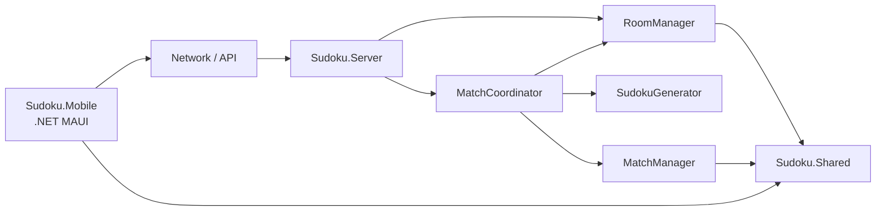

# UDM17 Sudoku hello nha

UDM17 Sudoku là dự án game Sudoku đối kháng qua mạng, gồm ứng dụng mobile, server quản lý phòng và trận đấu, cùng thư viện model dùng chung. Server chịu trách nhiệm tạo đề, giữ lời giải, xác thực nước đi và quản lý trạng thái của người chơi trong trận.


## Chức năng chính

- Tạo, tham gia, rời và liệt kê phòng chơi.
- Tổ chức trận Sudoku giữa hai người chơi.
- Sinh đề Sudoku ngẫu nhiên với nghiệm duy nhất.
- Hỗ trợ ba mức độ khó: `Easy`, `Medium` và `Hard`.
- Xác thực nước đi và theo dõi số câu đúng/sai tại server.
- Quản lý thời gian trận, mất kết nối, kết nối lại và kết quả trận đấu.
- Hỗ trợ snapshot dành cho người chơi và khán giả.
- Mobile client dùng .NET MAUI và lớp HTTP API client.

## Kiến trúc tổng quan



Luồng bắt đầu một trận:

```text
Phòng đủ hai người
        ↓
MatchCoordinator kiểm tra phòng và trận đang hoạt động
        ↓
SudokuGenerator sinh một cặp Puzzle + Solution
        ↓
MatchManager tạo và quản lý trận đấu
        ↓
Puzzle được dùng cho người chơi; Solution được giữ tại server để chấm nước đi
```

## Cấu trúc source code

```text
UDM17-Sudoku/
├── Sudoku.Mobile/                  # Ứng dụng client đa nền tảng
│   ├── Models/                     # ApiResponse, ConnectionStatus
│   ├── Network/                    # HTTP ApiClient
│   ├── Platforms/                  # Android, iOS, MacCatalyst, Windows
│   ├── Resources/                  # Icon, font, ảnh và raw assets
│   ├── App.xaml                    # Khởi tạo ứng dụng MAUI
│   ├── AppShell.xaml               # Điều hướng ứng dụng
│   ├── MainPage.xaml               # Giao diện trang chính
│   └── MauiProgram.cs              # Đăng ký và cấu hình MAUI
│
├── Sudoku.Server/                  # Server và game logic
│   ├── Game/
│   │   ├── RoomManager.cs          # Quản lý phòng và thành viên
│   │   ├── MatchCoordinator.cs     # Điều phối phòng, generator và match
│   │   ├── MatchManager.cs         # Quản lý trạng thái và nước đi
│   │   ├── MatchModels.cs          # Model nội bộ của trận đấu
│   │   ├── MatchRepository.cs      # Ranh giới lưu trữ trận đấu
│   │   └── SudokuGenerator.cs      # Sinh puzzle và solution
│   ├── Network/
│   │   ├── Server.cs               # TCP listener
│   │   └── ClientHandler.cs        # Nhận và gửi dữ liệu với client
│   ├── Form1.cs                    # WinForms host
│   └── Program.cs                  # Entry point của server
│
├── Sudoku.Shared/                  # Kiểu dữ liệu dùng chung
│   ├── Models/                     # Player, Room, GameState, SudokuCell
│   ├── Network/                    # Message, MessageType, Packet
│   └── Utils/                      # JsonHelper
│
└── UDM17-Sudoku.slnx               # Solution chứa các project
```

## Ngôn ngữ và công nghệ

| Thành phần | Công nghệ |
|---|---|
| Ngôn ngữ chính | C# |
| Giao diện Mobile | XAML, .NET MAUI |
| Mobile runtime | .NET 10 (`net10.0-android`, iOS, MacCatalyst, Windows) |
| Server | .NET Framework 4.7.2, Windows Forms |
| Shared library | .NET Framework 4.7.2 |
| Kết nối | TCP server/client handler và HTTP API client |
| Thuật toán Sudoku | Backtracking, đếm nghiệm, random seed |
| Xử lý đồng thời | `ConcurrentDictionary`, locking và async/await |
| Cấu hình project | XML (`.csproj`, `.slnx`, `.config`) |

## SudokuGenerator

`SudokuGenerator` sinh đồng thời một cặp đề và lời giải tương ứng:

```csharp
GeneratedSudoku generated = generator.GeneratePuzzle(
    SudokuDifficulty.Medium,
    seed: 20260811);

int[,] puzzle = generated.Puzzle;
int[,] solution = generated.Solution;
```

Các mức độ khó hiện tại:

| Độ khó | Ô trống | Ô gợi ý |
|---|---:|---:|
| Easy | 40 | 41 |
| Medium | 48 | 33 |
| Hard | 54 | 27 |

Generator có các đặc điểm:

- Dùng backtracking để sinh bảng Sudoku hoàn chỉnh 9×9.
- Clone solution trước khi xóa ô để puzzle và solution độc lập.
- Chỉ giữ một ô trống nếu puzzle vẫn có đúng một nghiệm.
- Dừng bộ đếm khi tìm thấy hai nghiệm để giảm chi phí tính toán.
- Hỗ trợ seed để tái tạo đề khi test, debug hoặc replay.
- Thử sinh lại tối đa 10 lần nếu chưa đạt số ô trống của độ khó.
- Bảo vệ quá trình sinh khi nhiều luồng sử dụng chung một instance.

## Luồng tạo và quản lý trận

`MatchCoordinator` là điểm điều phối khi bắt đầu trận:

1. Kiểm tra `roomId` là GUID hợp lệ và phòng tồn tại.
2. Kiểm tra phòng có đúng hai người chơi hợp lệ.
3. Kiểm tra phòng chưa có trận đang hoạt động.
4. Yêu cầu `SudokuGenerator` tạo một cặp puzzle–solution.
5. Truyền cùng cặp dữ liệu vào `MatchManager.StartMatch()`.

`MatchManager` tiếp tục kiểm tra kích thước bảng, giá trị, clue và solution trước khi tạo trận. Solution chỉ được giữ trong model nội bộ phía server để xác thực nước đi; player snapshot và spectator snapshot không chứa solution.

## Yêu cầu môi trường

- Windows 10/11.
- Git.
- .NET SDK 10.
- Visual Studio 2022 với workload **.NET Multi-platform App UI development** để build/chạy MAUI.
- .NET Framework 4.7.2 Developer Pack để build Server và Shared.
- Android SDK/emulator nếu chạy mobile client trên Android.

## Cài đặt và build

Clone repository:

```powershell
git clone https://github.com/letanphucthichdichoi11-sudo/UDM17-Sudoku.git
Set-Location UDM17-Sudoku
```

Build Server:

```powershell
dotnet build .\Sudoku.Server\Sudoku.Server.csproj --no-restore
```

Build Mobile cho Android:

```powershell
dotnet build .\Sudoku.Mobile\Sudoku.Mobile.csproj -f net10.0-android
```

## Quy ước Git

Tạo branch riêng cho mỗi chức năng hoặc lỗi:

```powershell
git checkout -b feature/ten-chuc-nang
```

Trước khi push:

```powershell
git status
git add <cac-file-can-commit>
git commit -m "feat: mo ta ngan gon thay doi"
git push -u origin feature/ten-chuc-nang
```

Lưu ý:

- Không commit thư mục `bin/`, `obj/`, file build hoặc thông tin bí mật.
- Không ghi đè thay đổi của thành viên khác khi pull/merge.
- Dùng commit message ngắn gọn, mô tả đúng nội dung thay đổi.
- Build project trước khi mở pull request hoặc merge vào `master`.
